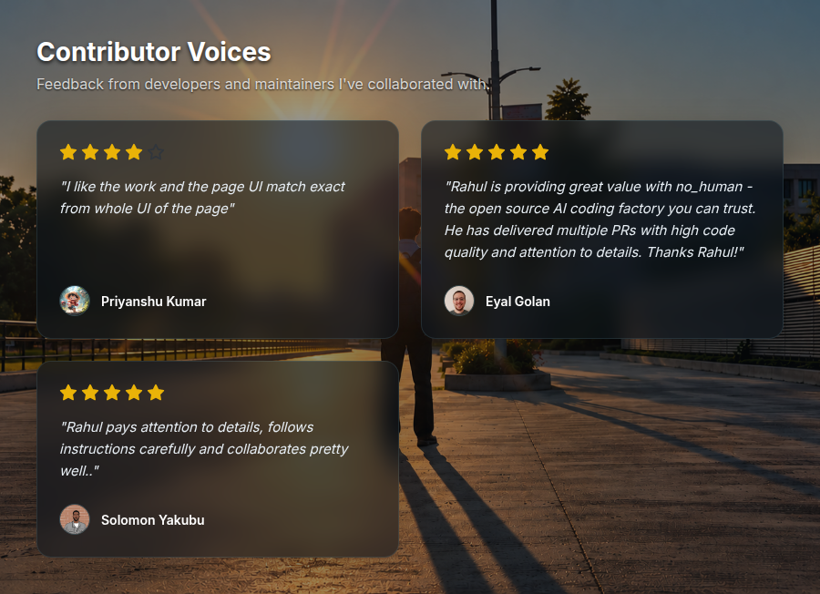

  <h1>Hi there, I'm Rahul Pamula 👋</h1>
  <h3>Full Stack Software Developer | AI & Cloud Enthusiast</h3>
  
   
  
  

   

  <h3>🚀 Featured Projects</h3>
  

    <b><a href="https://github.com/Rahul-pamula/open-source-scout">Open Source Scout</a></b> &bull; 
    <b><a href="https://github.com/Rahul-pamula/ShrFlow">ShrFlow</a></b> &bull; 
    <b><a href="https://github.com/Rahul-pamula/Email_To_Telebot">Email_To_Telebot</a></b> &bull; 
    <b><a href="https://github.com/Rahul-pamula/Chatnalyxer">Chatnalyxer</a></b> &bull; 
    <b><a href="https://github.com/Rahul-pamula/AgriFlow">AgriFlow</a></b>
  

   

  
<em>Passionate about building scalable web applications, designing RESTful APIs, and implementing robust cloud architectures.</em>

  
  
  

